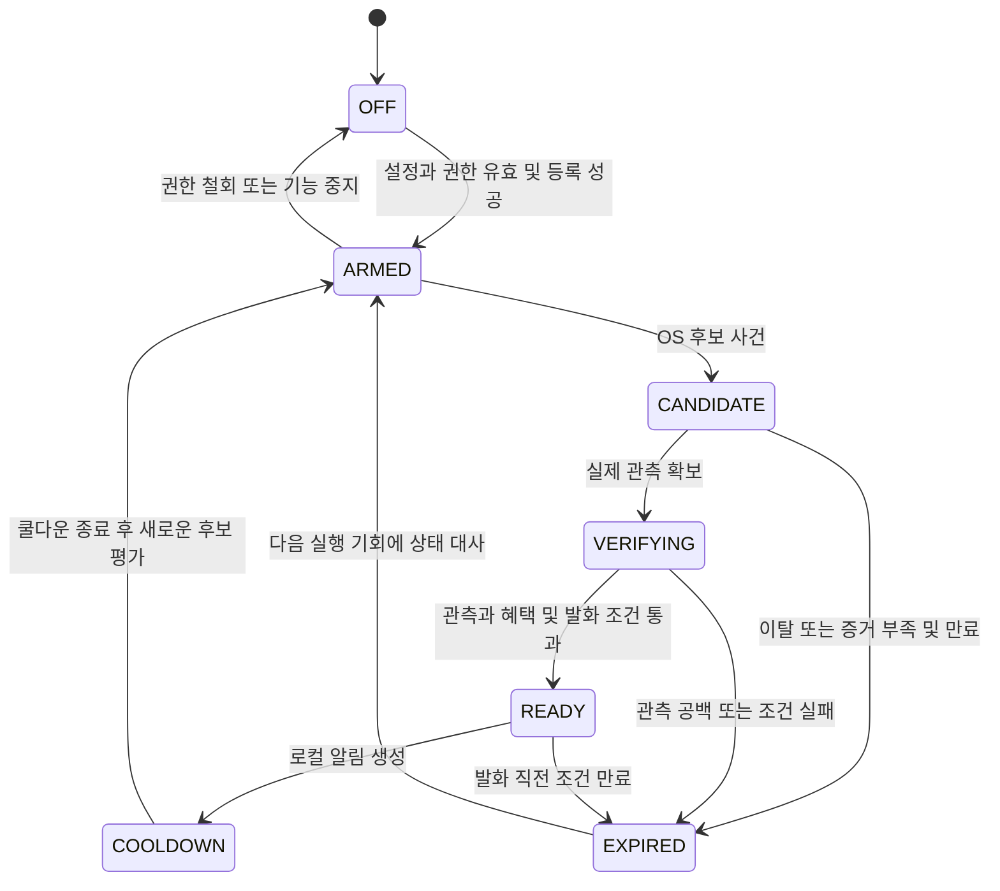
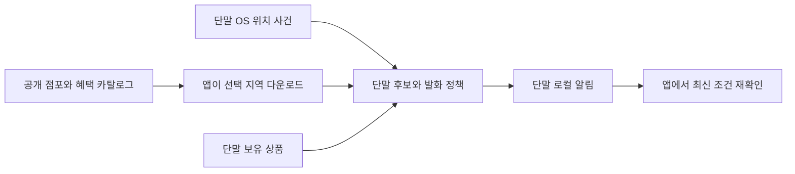

# 혜택패스 위치 알림 정책과 실기기 검증

기준일은 2026년 9월 30일이다. **위치는 주변 혜택을 찾는 신호로 사용한다. 1~2분 정지, 지오펜스 진입, 낮은 속도만으로 특정 매장의 방문이나 할인 적용을 확정하지 않는다.** 현재 테스트 기기는 iPhone이므로 첫 검증은 iOS에서 진행하고 Android는 실기기 확보를 별도 의존조건으로 둔다.

이 문서의 반경·시간·오탐·배터리 숫자는 실험 시작값 또는 수용 기준 제안이다. 실측 결과나 모든 단말의 품질 보증이 아니다.

## 1 위치 기능의 제품 약속

| 단계 | 사용 경험 | 진행 조건 |
|---|---|---|
| 기본 사용 | 브랜드·매장을 직접 선택하고 보유 혜택 확인 | 위치·알림 권한 없이도 사용 가능 |
| 전경 주변 찾기 | 앱을 열고 근처 목록을 요청하면 단말에서 거리순 후보 표시 | 위치 데이터 권리, 관련 절차, 사용 중 위치 권한 |
| 백그라운드 파일럿 | 사용자가 선택한 작은 생활권·즐겨찾기 주변의 혜택 확인 알림 | 플랫폼별 실기기·정책·동의·품질 게이트 |
| 공개 자동 알림 | 검증된 장소와 OS에서만 선택적으로 활성화 | 해당 플랫폼의 공개 출시 조건 통과. 실패한 장소·OS는 기능 축소 |

권장 문구는 “근처에서 확인할 수 있는 혜택이 있어요”다. “매장 입장 감지”, “2분 뒤 반드시 알림”, “이 매장에서 할인 확정”은 사용하지 않는다. 알림을 누르면 현재 선택한 상품·점포·기간·조건을 다시 확인한다.

배경 알림을 반드시 주력 기능으로 삼으려면 첫 기술 검증 과제로 둔다. 핵심 앱을 다 만든 뒤 이 기능이 불가능하다는 것을 발견하지 않도록 첫 2~4주에 iPhone 관측 가능성과 사용자 가치를 확인한다.

## 2 2분 체류로 횡단보도를 구별할 수 없는 이유

GPS는 실제 구매 의도를 관측하지 않는다. 횡단보도 대기 120초, 버스정류장 대기 180초, 카페 앞 줄서기, 교통 정체가 같은 반경과 속도를 만들 수 있다. 체류 조건을 3분으로 늘려도 정류장·정체 문제는 남으며 짧은 매장 방문을 놓칠 수 있다. 속도 0에 가까운 값도 방문 증거가 아니다.

OS의 지오펜스 사건 수신 시각은 사람이 도착한 시각과 다르다. 편의점이나 테이크아웃에서는 체류 조건과 OS 지연을 기다리는 동안 결제가 끝날 수 있다. 따라서 오탐률뿐 아니라 **결제 전에 알림이 도착한 비율**을 평가한다.

| 상황 | 기본 처리 | 남는 한계 |
|---|---|---|
| 20~60초 보행 통과 | 진입 즉시 알리지 않고 실제 관측 조건 평가 | 진입·이탈 사건이 늦거나 빠질 수 있음 |
| 교차로·횡단보도와 붙은 점포 | 매장·혜택 정보는 유지. 기본 자동 알림만 제한하고 주변 목록 제공 | 체류·속도만으로 대기와 방문을 구별할 수 없음. 자동 발견 기회는 줄어듦 |
| 버스정류장·도로 정체와 겹침 | 자동 점포 알림 제외 또는 사용자가 요청한 지역 안내로 별도 실험 | 완화한 지역 안내를 매장 방문 성공으로 집계하지 않음 |
| 길 건너 또는 인접 가게 | 한 지역 묶음으로 표시하거나 사용자 직접 선택 | 원형 반경은 건물 출입구·도로 경계를 표현하지 않음 |
| 쇼핑몰·지하·여러 층 | 건물 묶음과 직접 점포 선택 | GPS로 층·점포를 자동 확정하지 않음 |
| 매장 앞 대기 줄 | 근처 후보로 취급, 결제 전 조건 확인 유도 | 매장 내부인지 외부인지 별도 확인 불가 |
| 좌표 흔들림·오래된 위치 | 알림 보류와 후보 만료 | 품질을 높이려고 정확도 조건을 임의로 낮추지 않음 |

횡단보도 지도 매칭·실내 BLE·Wi-Fi 수집·움직임 ML은 초기 대응에 포함하지 않는다. 먼저 소수 장소를 직접 점검하고 혼잡한 장소의 자동 발화를 제한하는 운영이 1~2인에게 현실적이다. 정확한 방문 증거가 제품에 꼭 필요하다면 사용자 직접 확인 또는 매장 협력 신호를 별도 검토해야 한다.

### 정보 누락과 알림 누락을 구분

자동 알림을 제한하면 그 장소에서 혜택을 발견할 기회가 줄어든다. 이것은 오탐을 줄이는 대가이며 검색 목록에 남겨 둔 것만으로 자동 발견의 누락이 해결됐다고 주장하지 않는다. **위치 판별이 어렵다는 이유로 매장·혜택 데이터를 카탈로그에서 삭제하지 않는다.** 데이터 이용권·폐점·자료 오류에 따른 제외는 별도다.

| 제공 경로 | 모호한 장소의 처리 | 실제로 남는 누락 |
|---|---|---|
| 수동 검색과 전경 주변 목록 | 지원하는 매장과 혜택을 계속 표시. 사용자가 매장 선택 | 앱을 열지 않으면 발견하지 못할 수 있음 |
| 기본 자동 주변 안내 | 확인 가능한 장소부터 적용. 모호한 곳은 보류 | 알림 없이 지나간 실제 방문도 실패 분모에 포함 |
| 사용자가 선택한 지역 안내 | “이 지역 주변 혜택을 알려주세요”를 선택한 경우 여러 점포를 묶어 별도 시험 | 횡단보도에서도 안내될 수 있고 OS 누락도 남음. 특정 매장 방문으로 표현하지 않음 |
| 즐겨찾기와 시간 알림 | 즐겨찾기는 검색 접근성을 높임. 사용자가 정한 시간 알림은 위치와 독립 | 실제 도착을 자동 보장하지 않음 |

지역 안내는 알림 문구만 바꾼 우회책이 아니다. 대상 묶음·사용자 선택·발화 조건·빈도·평가를 별도로 둔다. 기본 모드는 엄격 관측 조건을 유지하고, 지역 안내 실험은 지역 진입 사건과 실행 기회에 얻은 최신 유효 위치를 기준으로 평가할 수 있다. 이 완화 모드는 120초 체류·점포 방문을 약속하지 않는다. 권한·동의·백그라운드 정책·자료 유효성·쿨다운 조건은 동일하게 적용한다.

지역 안내도 관련 없는 알림이 많거나 결제 전에 도달하지 못하면 끈다. 횡단보도에서 울린 것을 문구가 일반적이라는 이유만으로 성공 처리하지 않는다. 사용자가 원한 지역 정보인지와 알림 피로를 조사한다. 자동 모드 밖의 방문, OS 사건 누락, 자료 미지원, 제한 시간·쿨다운 억제를 각각 구분해 전체 발견률을 보고한다.

## 3 플랫폼에서 제공하는 것과 제공하지 않는 것

| 항목 | iOS | Android |
|---|---|---|
| OS 상한 | 앱당 모니터링 지역·조건 최대 20개 | 앱·기기 사용자당 최대 100개 지오펜스 |
| 기본 지역 사건 | 진입·이탈 또는 조건 변화 | ENTER·EXIT와 네이티브 DWELL |
| 체류 옵션 | 기본 원형 지역 API에 Android와 같은 DWELL 옵션 없음 | loiteringDelay 설정 가능, 실제 전달 시각은 best effort |
| 백그라운드 실행 | 앱 suspend·권한·시스템 실행 기회의 영향 | 절전·Doze·제조사 정책·백그라운드 제한의 영향 |
| 자동 재실행 | When in Use로 종료 앱 자동 실행을 기대하지 않음. Always도 지원하는 위치 서비스와 상태에 의존 | 백그라운드 권한과 등록 상태·플랫폼 제한에 의존 |
| 정밀 위치 거절 | 선택한 Core Location API의 reduced accuracy 제약 확인, 수동 지역 선택으로 축소 | fine 또는 필요한 background 권한이 없으면 점포·지역 묶음 지오펜스 중지. 전경 목록·직접 지역 선택으로 축소 |

상한과 실행 제약은 [Apple 지역 모니터링](https://developer.apple.com/documentation/corelocation/monitoring-the-user-s-proximity-to-geographic-regions), [Apple 위치 권한](https://developer.apple.com/documentation/corelocation/requesting-authorization-to-use-location-services), [Apple 정확도 권한](https://developer.apple.com/documentation/corelocation/cllocationmanager/accuracyauthorization), [Android 지오펜싱](https://developer.android.com/develop/sensors-and-location/location/geofencing), [Android 백그라운드 위치](https://developer.android.com/develop/sensors-and-location/location/permissions/background)에서 확인했다. Android의 백그라운드 사건 지연과 권고 반경은 120초 정시 알림이나 점포 입장 보장의 근거가 아니다.

**진입 콜백 → JS 타이머 120초 → GPS 재측정 → 알림**을 항상 실행하는 구조는 채택하지 않는다. 앱이 중간에 suspend되면 타이머와 재측정이 진행되지 않을 수 있다. iOS의 `earliestBeginDate`는 지정 시각에 실행한다는 뜻이 아니며, silent push도 전달이 보장되지 않는다. [Apple 작업 예약](https://developer.apple.com/documentation/backgroundtasks/bgtaskrequest/earliestbegindate), [Apple background push](https://developer.apple.com/documentation/usernotifications/pushing-background-updates-to-your-app)

진입할 때 120초 후 로컬 알림을 선예약하는 방식도 체류 검증을 대신하지 못한다. 앱이 실행되지 않아 현재 위치 확인이나 이탈 시 취소를 수행하지 못하면 사용자가 떠난 뒤 알림이 뜰 수 있다. 그 예약만으로 체류 조건이 통과했다고 처리하지 않는다.

## 4 공통 앱과 네이티브 연동 선택

React Native와 TypeScript로 화면·혜택 계산·알림 제한 정책을 공유한다. OS 권한, 지역 등록, 사건 수신, 위치 관측, 로컬 알림 생성은 실제 플랫폼 기능을 사용한다.

Expo를 선택하면 **development build**로 검증한다. Expo Go는 해당 백그라운드 실행 검증을 대체하지 못한다. 현재 Expo Location의 지오펜스 공개 API는 Enter/Exit를 제공하며 Android DWELL 설정은 노출하지 않는다. [Expo TaskManager](https://docs.expo.dev/versions/latest/sdk/task-manager/), [Expo Location](https://docs.expo.dev/versions/latest/sdk/location/)

첫 실험은 공통 Enter/Exit와 전경 관측으로 시작한다. Android DWELL이 반드시 필요한 경우 사용 중인 라이브러리의 기능·라이선스·현재 OS 지원을 확인하고, 부족하면 작은 네이티브 연동의 공수를 별도로 산정한다. 그 기능이 같은 방식으로 iOS에도 생긴다고 가정하지 않는다. 계속 실행되는 위치 서비스나 상시 GPS를 심사·배터리 제약의 기본 우회책으로 사용하지 않는다.

## 5 알림 조건의 평가 순서

아래 조건은 모두 통과해야 한다. 위치만으로 예상 절감액을 만들어 발화하지 않는다.

1. 사용자가 자동 주변 알림을 켰고 필요한 앱 동의와 OS 권한이 유효하다.
2. 해당 OS·장소의 자동 알림 기능이 검증되어 활성화된 상태다.
3. 허가된 점포 또는 건물 묶음에서 후보 사건을 받았다. 이벤트만으로 현재 체류를 확정하지 않는다.
4. 실제 실행 가능한 기회에 유효한 최신 위치를 얻었고, 선택한 모드의 관측 조건을 충족한다. 기본 모드의 엄격 관측과 별도 지역 안내 실험의 조건을 섞지 않는다.
5. 해당 지역에서 안내 가능한 최신 혜택이 있으며, 출처·권리·차단·기간 조건이 유효하다.
6. 보유 상품 정보가 있으면 단말에서 관련 혜택을 필터링한다. 개인정보를 서버로 전송하지 않는다.
7. 조용한 시간·장소 또는 브랜드 쿨다운·하루 한도·사용자의 차단 설정을 통과한다.
8. 즉시 또는 가능한 짧은 시점에 일반적인 근처 안내를 생성한다. 생성 직전 관측과 조건이 만료됐으면 취소한다.

예상 결제금액이 없으면 “500원 이상 아낄 때 알림” 같은 금액 조건을 계산할 근거가 없다. 초기에는 보유 수단과 연관된 최신 혜택 존재 여부로 안내하고 숫자를 넣지 않는다. 사용자가 금액을 직접 입력한 현재 세션에서만 확인한 조건 기준 예상 절감액을 필터로 쓸 수 있다.

### 실험 시작값

| 항목 | 제안값 | 해석 |
|---|---:|---|
| OS 후보 반경 | 150m | 근처 후보 영역. 점포 내부 반경이 아님 |
| 파일럿 지역·모니터링 | 생활권 1곳, 점포 또는 묶음 5~10개 | 초기에는 두 OS 모두 같은 소수 범위 |
| 체류 비교 | 60초·120초·180초 | 기본 비교점은 120초. 시간만으로 진급 금지 |
| 엄격 모드 관측 | 실제 유효 위치 3개 이상, 첫~마지막 120초 이상, 관측 간격 60초 이하 | 전경 또는 허용된 활성 세션의 관측. 배경에서 확보된다고 가정하지 않음 |
| 최신 위치 age | 마지막 관측 30초 이내 | 오래된 cached 좌표는 현재 위치로 사용하지 않음 |
| 수평 정확도 | 50m 이하에서 시작 | 실험값. 반드시 50m 이내라는 오차 보장 아님 |
| 경계 여유 | 거리 + 수평 정확도 값 ≤ 후보 반경 | 보수적 필터. 매장 안·도로 밖을 증명하지 않음 |
| 후보 최대 수명 | 최초 실제 관측 후 5분 | 늦은 콜백으로 오래된 후보를 유지하지 않음 |
| 묶음·브랜드 쿨다운 | 24시간 | 겹치는 지역의 반복 발화 억제 |
| 하루 한도 | 2건 | 로컬 날짜 Asia/Seoul 기준. 사용자가 더 낮추거나 끌 수 있음 |
| 조용한 시간 | 21:00~08:00 | 초기에는 야간 광고 알림을 제공하지 않음. 다음 아침 밀린 위치 알림을 보내지 않음 |

수평 정확도와 속도는 유효성부터 확인한다. 음수 속도를 정지로 바꾸거나 정확도 값을 확정 오차 한계로 사용하지 않는다. [Apple horizontalAccuracy](https://developer.apple.com/documentation/corelocation/cllocation/horizontalaccuracy), [Apple speed](https://developer.apple.com/documentation/corelocation/cllocation/speed)

엄격 모드에서 추가 관측이 없으면 **보류·만료**한다. Android 완화 모드를 시험하면 네이티브 DWELL과 실행 기회에 얻은 최신 유효 위치를 사용하고, 엄격 모드의 3회 관측 조건만 별도로 완화한다. 최신 위치가 없으면 보류한다. 근처 안내로 명시하고 별도 지표로 평가하며 iOS에 동일 모드가 있다고 약속하지 않는다. 오탐과 누락을 포함한 가치가 낮으면 자동 알림 출시를 중단한다.

## 6 상태와 예외 처리

타이머 경과는 상태를 READY로 바꾸는 사건이 아니다. 모든 상태에서 권한 철회·혜택 차단·전체 기능 중지를 우선 적용한다. 쿨다운은 발화한 묶음과 브랜드를 단말에 보존해 프로세스 재시작 후 중복을 막는다. 원시 위치를 장기간 기록할 필요는 없다.

기능 중지·전체 삭제는 OFF 전환 → 지오펜스 등록 해제·위치 업데이트 task 중지 → 후보·예약 알림·단말 데이터 정리 순서로 처리한다. 다음 실행에서 이전 동의·등록을 자동 복원하지 않는지 시험한다. 이미 표시한 알림의 정리와 아직 예약한 알림의 취소도 구분한다.

| 예외 | 처리 |
|---|---|
| 앱이 suspend되어 추가 관측 없음 | 후보만 유지하되 실제 다음 실행 때 수명 검사. 기한이 지났으면 무알림 폐기 |
| EXIT가 없고 오래된 ENTER만 존재 | 연속 체류로 간주하지 않음. 관측 공백 기준 적용 |
| ENTER·EXIT 중복 또는 순서 바뀜 | 측정 시각·사건 시각이 있으면 대사. 수신 시각만으로 물리적 순서를 보장하지 않음 |
| 재등록 당시 이미 Inside | 새 방문으로 즉시 발화하지 않음 |
| 재부팅·OS 업데이트·앱 업데이트 | 다음 허용 실행 기회에 설정·등록·후보 상태 대사. 계속 동작 보장 금지 |
| 시스템 종료와 사용자 강제 종료 | 별도 테스트 사례로 기록. 같은 종료 상태로 묶지 않음 |
| 위치 전역 끔·정밀 위치 거절·절전·Background App Refresh 제한 | 기능 제한 사유 표시, 전경 목록·직접 지역 선택 유지 |
| 네트워크 끊김 | 안전 상태와 혜택 TTL 범위만 사용. 만료·차단 확인 기한 초과면 자동 알림 중지 |
| 단말 시계 변경 | 원문 유효기간·쿨다운을 재평가. 신뢰할 시간 근거가 부족하면 발화 보류 |
| 알림 등록 실패 | 성공으로 기록하지 않음. 무한 재시도 금지 |

사용자에게 사건 없음, 위치 불확실, 관련 혜택 없음, 제한 시간, 중복 억제, 권한 제한을 구별해 설명한다. 단말이 보고하지 않는 원인을 정확히 안다고 주장하지 않는다.

## 7 로컬 알림과 서버 푸시

초기 위치 알림은 단말 로컬 알림으로 구성한다. APNs·FCM push token 등록과 서버의 사용자 위치 스트림을 요구하지 않는다. 로컬 알림도 OS 알림 권한과 목적에 맞는 설정·동의가 필요하다. [Apple 알림 권한](https://developer.apple.com/documentation/usernotifications/asking-permission-to-use-notifications)

서버 푸시는 후속 운영공지·사용자 요청 사건에 필요한지 따로 검토한다. 넣는다면 token 보호·철회·만료, 전송 상태·재시도·중복 억제·발송 만료·국외 처리와 개인정보 공개를 추가한다. **FCM·APNs 수락은 사용자 표시나 읽음의 증거가 아니다.** 서버 푸시는 iOS 재측정이나 체류 타이머를 보장하는 해결책으로 쓰지 않는다.

잠금화면에는 카드명·지갑 목록·실적 상태·좌표·보장 절감액을 넣지 않는다. 위치 알림은 짧은 일반 문구로 제공한다. 할인·쿠폰 안내의 광고성 여부는 로컬·원격 여부만으로 면제 판정하지 않는다. [동의와 법률 검토](05_법률개인정보_및_출처.md)를 따른다.

## 8 iPhone부터 시작하는 시험

첫 주에 기기 모델·OS·배터리 상태, 개발 빌드 버전, 선택한 위치 API, 앱 권한과 알림 설정을 기록한다. Mac의 실제 Xcode·iOS SDK와 기기 지원 여부를 확인한다. 보유 iPhone 모델과 OS는 아직 확인되지 않았다.

### 필수 현장 사례

| 사례 | 확인할 것 |
|---|---|
| 실제 매장 입장 3~5분 체류 | 후보·추가 관측·누락·도착부터 알림까지 시간·결제 전 도달 |
| 보행 통과 20~60초 | 불필요한 발화 |
| 횡단보도 60·120·180초 대기 | 시간만으로 발화하는지, 인접 점포 제외 효과 |
| 정류장과 차량 정체 3~5분 | 정지 오탐과 속도 필터 한계 |
| 길 건너·인접 매장·몰 다른 층 | 특정 점포로 잘못 표현되는지 |
| 잠금 30분·저전력·백그라운드 새로고침 제한 | 실행 기회·지연·누락과 폴백 |
| 강제 종료·시스템 종료·재부팅 전후 | 후보 복구·중복·등록 상태 |
| 대략적 위치·GPS 흔들림·통신 없음 | 오래되거나 불확실한 위치의 잘못된 통과 |
| 권한 철회·차단·혜택 만료·조용한 시간 | 즉시 중지, 예약 정리, 뒤늦은 알림 없음 |
| 중복 사건·Inside 재등록·기기시각 변경 | 상태 재시작 후 중복 발화 없음 |

위치 시뮬레이션과 에뮬레이터는 상태 로직을 시험하는 도구다. 실제 수신 지연·배터리·절전 동작을 대신하지 않는다.

### 표본과 지표

탐색 단계는 iPhone에서 양성 방문 20회, 음성 상황 40회 정도부터 시작한다. 공개 후보 평가는 플랫폼별로 새로운 경로·시각에서 양성 60회·음성 100회 정도를 계획한다. 이는 비용을 산정하기 위한 제안이며 적절한 모집·기기 다양성과 관측 시간도 함께 정해야 한다.

같은 사람이 같은 길을 반복하면 독립 표본이 아니다. 기기·사람·장소·날짜·화면 상태별 결과를 나눠 보고한다. 튜닝에 사용한 경로를 최종 검증으로 재사용하지 않는다. 배경 실행 가능한 방문만 골라 높은 수신율을 만드는 방식도 금지한다.

| 지표 | 분모와 기록 | 수용 가설 |
|---|---|---|
| 음성 상황 오탐 | 방문하지 않은 시험 전체 중 자동 발화 | 5% 이하부터 검토 |
| 알림의 적절성 | 생성된 알림 전체 중 사용자가 유용한 주변 안내로 평가 | 90% 이상부터 검토 |
| 실제 방문 coverage | 지원 생활권의 실제 방문 전체 중 유효 알림. 자동 모드 제외·보류·사건 누락·한도 억제 포함 | 70% 이상부터 검토. 활성 장소만 골라 분모를 줄이지 않음 |
| 전체 혜택 발견 | 실제 과업 전체 중 알림·전경·수동 경로로 발견. 자료 미지원도 별도 기록 | 자동 알림 성공률과 분리. 목록 유지가 자동 누락을 해결했다는 주장 금지 |
| 선택형 지역 안내 coverage | 해당 모드를 선택한 사용자의 선택 지역 실제 진입 과업 전체. OS 사건 누락·보류·쿨다운 포함 | 기본 모드와 별도 보고. 수신한 후보만 분모로 쓰지 않음 |
| 선택형 지역 안내 적절성 | 생성된 지역 알림 전체 중 유용한 안내·무관한 발화·차단·결제 전 도달 | 지역 진입을 매장 방문 성공으로 합산하지 않음 |
| 결제 전 도달 | 실제 결제 방문 전체 중 결제 전에 온 유효 알림 | 현장 조사로 기준 설정. 늦은 알림을 성공으로 합산하지 않음 |
| 지연 | 실제 도착→표시 p50·p90, 사건 수신→생성도 별도 | 2분 보장 없음. 미수신은 지연 통계에서 별도 표시 |
| 배터리 | 같은 기기·환경의 on/off 8시간 시험 최소 3쌍 | 추가 소모 중앙값 3%p 이하를 탐색 가설로 사용 |
| 피로 | 사용자당 발화 수·끄기·장소 차단·무관한 알림 신고 | 사용자 선택과 하루 한도 작동 필수 |

비율은 표본 수와 신뢰구간을 함께 보고한다. 독립 시행을 가정해도 음성 20회에서 오탐 0건은 95% 단측 상한이 약 14%이므로 5% 이하를 입증하지 않는다. 단말 배터리 표시의 해상도와 건강 상태도 시험 한계다.

**Android 실기기 확보 전에는 Android의 배경 위치·배터리·알림 품질을 통과 처리하지 않는다.** 최소 1대의 실제 지원 단말로 시작하고, 확장 시 제조사·OS 다양성을 늘린다. 확보되지 않으면 전경 기능 검증과 빌드 호환성까지만 완료로 기록한다.

## 9 공개 활성화와 실패 시 처리

양 플랫폼은 화면과 규칙을 공유하지만 자동 알림 플래그는 각각 둔다. 장소 품질도 별도 활성 목록으로 관리한다. 법률·권리·동의·기기·심사·현장 품질 중 한 항목이라도 실패하면 해당 자동 기능을 끈다.

즐겨찾기 매장 지오펜스도 백그라운드 위치 기능이므로 Google Play 심사를 우회하는 폴백이 아니다. 정책 반려 시의 폴백은 전경 목록, 직접 점포 선택, 위치와 무관한 사용자가 설정한 시간 알림이다. 광고·오퍼의 작은 편익만으로 백그라운드 위치 승인이 보장되지 않는다. [Google Play 백그라운드 위치 정책](https://support.google.com/googleplay/android-developer/answer/9799150?hl=en)

출시 후에도 오탐 사례가 집중되는 장소는 제외하고 원격 기능 중지 상태를 동기화한다. 오프라인 단말을 즉시 중지시킬 수 없으므로 안전 동기화 기한을 넘긴 자동 알림은 단말에서 만료한다. 정책 숫자를 조정하기 전에 어떤 신호가 부족했는지 먼저 확인한다.
