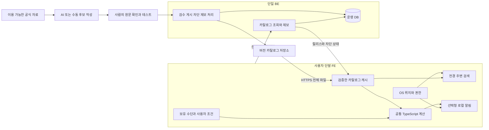
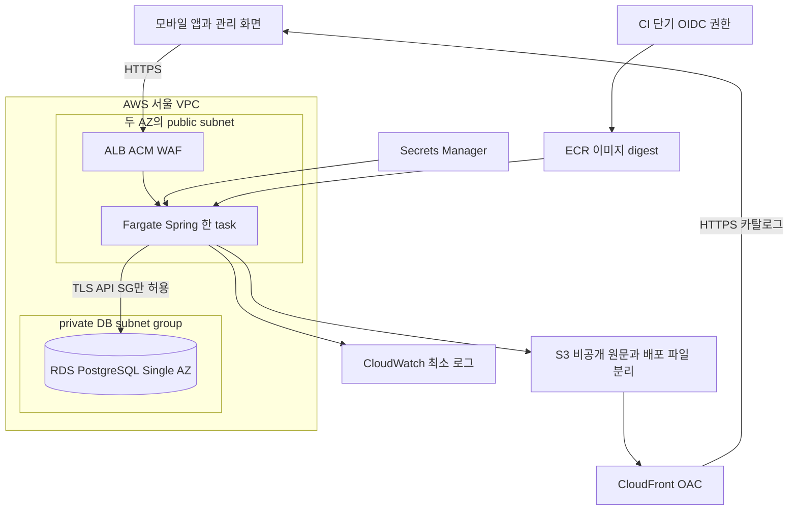

# 혜택패스 아키텍처와 Docker AWS 실행 구조

기준일은 2026년 9월 30일이다. 권장 구조는 **양 플랫폼 모바일 앱, 하나의 카탈로그·운영 서버, 필요할 때 실행하는 AI 보조 작업**이다. 위치와 지갑은 단말에서 처리하고 서버는 검수된 공개 혜택 데이터를 배포한다. 이 문서는 설계안이며 실행되는 앱·Docker 구성·AWS 리소스를 생성한 결과가 아니다.

## 1 선택한 구조와 대안

| 선택지 | 장점 | 비용과 한계 | 판단 |
|---|---|---|---|
| 정적 카탈로그와 단말 앱 | 서버 운영이 가장 적음. 지갑·계산·전경 검색 가능 | 제보 운영과 승인·차단 관리가 파일 작업 중심. 위치 제약은 동일 | 1인이고 가용시간이 적으면 검증판 대안 |
| 단일 BE와 단말 앱 | 데이터 검수·게시·차단·제보 흐름을 일관되게 관리 | 작은 운영 서버와 DB 필요 | 1~2인 기본 권고 |
| FE·BE·AI 상시 서비스 각각 분리 | 독립 배포가 필요한 팀에는 유용 | 네트워크·인증·장애·배포 지점 증가 | 초기에는 채택하지 않음 |

모바일은 React Native와 TypeScript를 사용한다. BE는 Spring Boot와 지원되는 Java LTS, 데이터 보조 작업은 Python을 기본안으로 둔다. 실제 팀 경험이 다른 경우 첫 작은 빌드로 비교한 뒤 바꾼다. 팀의 숙련도를 확인하지 않고 특정 프레임워크가 가장 빠르다고 단정하지 않는다.

React Native를 사용해도 위치·권한·알림·앱 생명주기는 OS별 구현과 검증이 필요하다. Expo를 선택할 경우 development build와 필요한 네이티브 모듈 지원을 확인한다. Expo Go의 성공을 백그라운드 위치 검증으로 사용하지 않는다. [React Native 환경 설정](https://reactnative.dev/docs/set-up-your-environment), [Expo Location](https://docs.expo.dev/versions/latest/sdk/location/), [Expo TaskManager](https://docs.expo.dev/versions/latest/sdk/task-manager/)

## 2 책임과 데이터 흐름



이 흐름에 사용자 좌표·카드 번호·결제 내역·지갑 업로드는 없다. 지역별 전체 점포 목록을 내려받아 단말에서 거리를 계산한다. 지역 선택은 사용자가 직접 고르는 생활권 코드로 시작한다. 서버에 정밀 좌표를 보내는 타일 조회로 바꾸면 그 자체가 개인정보 설계 변경이다.

단말 로컬 알림은 Apple·Google에 서버 push 요청을 보내지 않는다. 카탈로그 변경을 알리는 원격 push가 필요해지면 APNs·FCM, 토큰 삭제, 광고 동의, 국외 처리, 전송 실패를 별도로 설계한다. 단말 알림만 제공하는 초기 구조에는 push token 테이블·outbox·상시 알림 worker를 만들지 않는다.

점포 데이터의 지원 여부와 자동 알림 정책은 다른 필드로 관리한다. 예를 들어 기본 주변 안내, 사용자 선택 지역 안내의 시험 대상, 전경 목록만 제공하는 장소로 구분한다. 방문 판별이 어려운 점포도 카탈로그·검색에는 남는다. 자동 발화를 끈 것은 데이터 삭제가 아니며 전체 발견률의 분모에서 해당 방문을 빼지 않는다.

AI는 허용된 비개인 자료에서 후보를 작성하거나 원문 변경을 비교하는 도구다. AI 결과는 검수 전 데이터이며 게시·금액 확정·중복 할인 확정 권한을 갖지 않는다. 사용자 요청마다 LLM을 호출하는 구조는 필요하지 않다.

## 3 제안하는 저장소 구조

아래는 개발 착수 시 사용할 논리 구조다. 이번 문서 작업에서 빈 코드 폴더를 생성하지 않았다.

```text
SubProject/
  FE/
    mobile/             React Native 앱과 iOS Android 네이티브 설정
    admin/              작은 검수 게시 차단 제보 화면
  BE/                   Spring 단일 앱과 DB 마이그레이션
  AI/                   선택형 자료 비교 후보 작성 CLI
  packages/
    benefit-core/       순수 TypeScript 계산과 금액 테스트
  contracts/            카탈로그 JSON Schema와 API 계약
  infra/
    local/              Docker Compose와 개발 환경 예시
    aws/                선택한 AWS 구성을 재현할 정의
  docs/                 현재 기획 검토와 운영 문서
```

하나의 모바일 앱에서 두 OS를 빌드한다. 계산 규칙은 네트워크·GPS·현재 시각에 직접 의존하지 않는 함수로 작성하고, 금액·날짜·사용자 조건을 입력으로 받는다. FE 관리 화면에서도 같은 TypeScript 엔진으로 미리보기와 금액 테스트를 실행한다. BE가 Java로 계산을 다시 구현해 두 엔진을 운영하지 않는다. 서버 계산이 실제로 필요해지는 시점에 하나의 계산 권위를 다시 선택한다.

BE 내부는 카탈로그, 검수·릴리스, 차단, 제보, 감사 기록으로 나누되 한 프로세스로 배포한다. 관측한 성능 문제 전에는 Kubernetes, Redis, Kafka, OpenSearch, 벡터 DB, 범용 조건 DSL, 분산 작업 lease를 추가하지 않는다.

## 4 단말과 서버의 저장 책임

| 위치 | 저장할 정보 | 보호와 삭제 |
|---|---|---|
| 단말 지갑 | 상품 ID, 선택한 멤버십 등급, 사용자가 입력한 충족·미충족·모름 | OS 보호 저장소와 보호된 DB 사용. 백업 정책 명시. 카드 번호·CVC·금융 인증정보 입력란 없음 |
| 단말 카탈로그 | 배포 권리가 있는 요약·산식·공식 출처·점포 좌표·버전 | 호환성·해시·참조·기간 검증 후 원자 교체. 차단·신선도 제한 적용 |
| 단말 위치 | 현재 후보 확인에 필요한 좌표 | 기본적으로 메모리에서 처리. 이동 경로를 서버·분석 SDK에 기록하지 않음 |
| 단말 알림 상태 | 동의 상태, 지역·브랜드 쿨다운, 당일 발화 횟수 | 필요한 짧은 기간만 유지. 전체 삭제 시 캐시·키·예약 알림도 정리 |
| 서버 | 출처·권리·규칙 버전·점포·릴리스·차단·제보·관리 감사 | 사용자 지갑과 이동 이력 없음. 제보 자유 입력과 IP·운영자 정보는 별도 개인정보 관리 |
| 비공개 자료 저장소 | 허가 근거와 확인에 필요한 원문 증거 | 계약이 허용한 보존·접근·삭제만. 공개 카탈로그와 분리 |

앱 삭제만으로 Keychain 등 모든 잔존 정보가 없어졌다고 약속하지 않는다. 앱 안의 전체 삭제 기능으로 DB·보호 키·식별 상태·알림을 정리하고 재설치·백업 복원에서 이를 시험한다. 법정 보존 기록은 사용자 편의 캐시와 별도다. 상세 보존안은 [법률과 개인정보](05_법률개인정보_및_출처.md)를 따른다.

전체 삭제·기능 중지는 먼저 자동 기능을 OFF로 전환하고 OS 지오펜스 등록 해제·위치 업데이트 중지를 수행한 뒤 후보·예약 알림·DB·키를 정리한다. 앱 재실행 시 삭제한 동의와 지역이 자동 재등록되지 않게 한다.

## 5 최소 운영 모델

| 논리 모델 | 필요한 역할 |
|---|---|
| source_version | 원문 버전, 확인일, 이용 허가 범위, 보존·철회 조건 |
| offer_version | 조건·금액·중복·출처를 가진 혜택 버전. 검수 후 불변 |
| place | 공개 점포 ID·위치·브랜드. 할인 수용 여부는 별도 증거 |
| catalog_release | 검증한 버전 집합, schema·semantics 버전, 파일 해시 |
| release_activation | 현재 게시된 릴리스와 이전 활성화 기록 |
| suspension | 규칙·상품·지역·기능 차단과 사유. 릴리스 롤백과 독립 |
| error_report | 제보 내용·처리 상태·삭제 확인용 정보 |
| audit_event | 누가 검수·게시·차단·복구했는지 기록 |

이는 초기 책임 구분이며 테이블 개수를 목표로 삼지 않는다. 브랜드·상품의 작은 참조 목록은 릴리스 안에 포함하고 실제 독립 수정 요구가 생기면 테이블로 분리한다. 초기 소량 점포의 단말 거리 계산에는 PostGIS가 필요하지 않다.

개인정보가 포함될 수 있는 제보의 관리자 조회·다운로드·삭제에도 필요한 접속·감사 기록을 남긴다. 이 기록의 보존·점검·위변조 방지는 일반 HTTP 오류 로그의 짧은 보존안과 분리하여 법정 요건을 확인한다. 기록에 제보 본문·좌표를 복제하지 않는다.

초안은 편집할 수 있지만 검수 후 내용이 바뀌면 승인을 무효화한다. 승인된 혜택은 새 버전으로 수정한다. 원문·권리 범위가 바뀐 경우 기존 승인이 자동 승계되지 않는다. 유효 기간은 혜택 기간, 이용권 기간, 원문 확인 기한 중 가장 이른 제한을 따른다.

## 6 지원할 카탈로그 계약

카탈로그는 안내와 계산을 구분한다. 안내만 가능한 혜택에는 계산 객체를 넣지 않는다. 계산 객체의 최초 지원 범위는 정률 또는 정액, 명시된 기준 금액·원 단위 처리·상한, 브랜드·채널·기간, 사용자 확인 조건이다. 점포나 상품 세부 조건을 지원하지 못하면 안내 또는 미확인 상태로 둔다.

규칙에는 다음을 빠뜨리지 않는다.

| 필드 묶음 | 계약 |
|---|---|
| 식별 | ruleId, version, 상품·브랜드 참조, 지원 OS와 앱 의미 버전 |
| 출처 | 공식 URL, 원문 버전, 확인일, 표시 가능한 권리 범위 |
| 사용 | 기간·시간대·채널·제외 조건·이용 절차 |
| 계산 | integer KRW, 정률 basis points 또는 정액 원, 기준 금액, 반올림 방식, 적용 상한 |
| 사용자 조건 | 실적·등급·잔여 한도 등의 필요한 입력과 모름 처리. 서버 자동 조회 없음 |
| 중복 | 허용된 조합 ID·순서·각 계산 기준 금액과 그 근거. 관계 없음은 허용이 아님 |
| 검수 | 작성·검수 근거, 금액 경계 테스트, 계산 가능 또는 안내 전용 상태 |

MCC·PG 추정과 범용 조건 DSL은 초기 계약에서 제외한다. 금액은 입력 조건 기준 예상값으로 정의한다. 지원 필드와 실제 예제를 동일 Schema로 검증한다. 구체적인 미확인 처리와 계산 경계는 [할인 데이터 문서](02_할인데이터_확보와_운영.md)가 기준이다.

## 7 최소 API와 접근 제어

| API 역할 | 필요한 동작 |
|---|---|
| 공개 bootstrap | 현재 releaseId, 호환 버전, 다운로드 URL·크기·해시, 원문 기한, 차단 상태, 기능 flag, 서버 확인 시각 |
| 전체 카탈로그 | immutable releaseId로 조회. 최초에는 전체 소량 파일을 내려받음 |
| 선택적 제보 | 문제 규칙·상황·비개인 설명. 금액·위치·카드 정보 업로드는 기본값 아님 |
| 제보 삭제 | 제출 시 발급한 충분히 긴 임의 삭제 토큰으로 본인 제보 삭제. 토큰은 서버에 해시 저장 |
| 관리 import와 검수 | 허용 형식의 자료 입력, 검수 결과와 테스트 기록 |
| 관리 publish와 activate | 검증한 파일 생성·배포 후 원자적으로 활성화 |
| 관리 suspend와 rollback | 잘못된 규칙·기능 차단, 이전 호환 릴리스 선택 |
| 관리 제보 inbox | 조회·분류·종결·삭제. 상태 API만 만들고 처리 화면을 빼지 않음 |

경로는 `/v1/bootstrap`, `/v1/catalog/{releaseId}`, `/v1/reports`를 출발점으로 정하고 정확한 OpenAPI는 구현 시 확정한다. 공개 사용자 계정은 없으며 설치 ID를 관리자 인증으로 쓰지 않는다. 관리자는 검증된 기존 인증과 MFA를 사용하고 관리자 허용 목록·서버 권한을 확인한다. AI·import 실행자에게 publish 권한을 주지 않는다.

입력 길이·파일 크기·형식·참조·금액 상한을 검사하고 임의 URL fetch를 허용하지 않는다. 제보에는 rate limit을 적용한다. 요청 본문·지갑·좌표·인증정보·삭제 토큰을 로그에 남기지 않는다. 공개 카탈로그는 사용자가 추출할 수 있으므로 해시와 앱 화면만으로 재배포를 막을 수 있다고 설명하지 않는다. 원시 규칙의 단말 배포가 허용되지 않으면 이 구조로 해당 자료를 배포하지 않는다.

## 8 게시와 단말 갱신

게시 순서는 후보 작성, 원문 검수, 테스트, 릴리스 파일 생성, 비공개 저장소 업로드, 다운로드 검증, 활성 포인터 변경이다. 파일 업로드 전 DB 포인터부터 바꾸지 않는다. 게시 실패 시 이전 릴리스를 유지한다. 동시 게시에는 DB transaction과 버전 확인을 사용한다.

단말은 HTTPS와 허용된 배포 host를 확인하고 파일을 임시 저장한 뒤 크기·SHA-256·Schema·상품 참조·의미 버전·앱 최소 버전을 검증한다. 모두 통과한 뒤 캐시를 교체한다. 해시는 파일의 일관성 확인이며 별도의 이용 허가나 DRM이 아니다. 실패하면 마지막 안전한 캐시를 기한 안에서 사용한다.

정상 bootstrap에서 받은 새 차단 상태와 기능 OFF는 새 카탈로그 다운로드의 성공과 무관하게 먼저 저장·적용한다. 이전 캐시를 유지하면서 이미 받은 차단이나 기능 중지를 무시하지 않는다. 파일 갱신의 원자성과 안전 상태의 우선 적용은 다른 경로다.

| 갱신 항목 | 제안 정책과 한계 |
|---|---|
| 온라인 안전 상태 | 실행·전경 복귀·계산 전에 조회. 같은 세션의 1분 이내 성공 응답은 재사용 가능 |
| 단말 안전 확인 기한 | 마지막 정상 확인에서 최대 24시간. 지나면 사전 탑재 규칙의 계산·자동 알림을 보류하고 갱신 요청 |
| 원문 신선도 | 변동성별 14일·45일 등 검수 주기. 단말의 24시간 확인과 별개이며 원문 기한 경과는 계속 차단 |
| 차단 overlay | 이전 릴리스로 돌아가도 적용. 롤백으로 잘못된 규칙이 다시 살아나지 않게 함 |
| 사용자 직접 작성 | 사전 탑재 데이터와 분리. 사용자 입력이라는 표시와 미확인 조건 유지 |
| 기기 시계 변화 | 서버 시각과 경과시간을 검증. 재부팅·시계 조작 등 기한 판단이 불확실하면 재동기화 전 보류 |

24시간은 계약과 파일럿에 맞춰 더 줄일 수 있는 설계 시작값이다. 무통신 단말에 즉시 차단을 전파하지 못하며 OS가 정시에 앱을 실행한다고 가정하지 않는다. 즉시 철회가 필요한 라이선스라면 온라인 확인을 필수화하거나 해당 자료의 오프라인 배포를 포기한다. 비상 차단의 운영 목표와 모든 단말 도달 보장을 혼동하지 않는다.

bootstrap 실패·타임아웃·검증 실패는 마지막 정상 안전 확인 시각을 연장하지 않는다. 기존 캐시는 가장 이른 사용 기한까지만 이용한다. 정상 확인 이력이 없거나 기한 판단이 불확실하면 사전 탑재 계산·자동 기능을 보류한다. 실패를 변경 없음 또는 정상 동기화로 기록하지 않는다.

실제 사용 기한은 안전 확인 시각+24시간, 원문 신선도 기한, 혜택 종료, 이용권 종료 중 가장 이른 값이다. 예약 알림에도 이 기한을 적용하고 차단·권한 철회 시 취소한다. 앱이 실행되지 않아 예약 취소를 못 할 수 있으므로, 지연된 예약으로 현재 위치·혜택 유효성을 확인할 수 없는 방식은 기본 자동 알림으로 사용하지 않는다.

## 9 Docker와 모바일 실행의 경계

| 구성 | 실행 위치 | 검증할 내용 |
|---|---|---|
| BE와 PostgreSQL | 로컬 Docker Compose | 빈 DB migration, import·검수·게시·차단·복구·제보 삭제 |
| AI 도구 | 선택형 Compose tools profile 또는 일회 CLI | 허용 자료만 입력, schema 검사, 비용 상한, 게시 권한 없음 |
| Metro와 앱 개발 도구 | 개발 Mac | 공통 코드, 네이티브 모듈, dev/prod endpoint 구분 |
| iOS 빌드와 실기기 | Mac Xcode와 보유 iPhone | 서명·권한·위치·로컬 알림·잠금·앱 재시작·전체 삭제 |
| Android 초기 개발 | Android Studio Emulator | 빌드·화면·계산·API. GPS·절전·배터리 품질의 최종 증거로 사용하지 않음 |
| Android 출시 검증 | 실제 Android 기기 | 백그라운드·알림·Doze·제조사 절전·위치 정확도 |

iOS 네이티브 빌드는 Mac과 Xcode가 필요하다. Linux Docker에 앱 빌드·코드 서명·두 OS 실기기까지 포함하려 하지 않는다. 개발 Mac의 사양·Xcode 호환 여부는 착수 전에 확인한다. [React Native 공식 환경 설정](https://reactnative.dev/docs/set-up-your-environment)

실기기의 `localhost`는 휴대폰 자신이다. 신뢰할 수 있는 같은 Wi-Fi에서 개발 Mac의 LAN 주소와 공개한 BE 개발 포트를 사용한다. Android Emulator에서 개발 host loopback은 `10.0.2.2`다. Docker의 BE→DB 서비스 이름과 컨테이너→host의 `host.docker.internal`은 다른 방향이며 휴대폰 주소가 아니다. [Docker Desktop 네트워킹](https://docs.docker.com/desktop/features/networking/), [Android Emulator 네트워킹](https://developer.android.com/studio/run/emulator-networking)

DB 포트는 외부 LAN에 열지 않는다. 로컬 HTTP 예외가 필요하면 debug 앱에만 제한한다. 공개 release는 HTTPS를 사용한다. 개발·테스트·운영의 DB, endpoint, 비밀을 분리한다. Apple Silicon에서 만든 ARM64 이미지와 AWS의 CPU 아키텍처를 일치시키고 운영 아키텍처의 이미지로 확인한다. [Docker multi-platform build](https://docs.docker.com/build/building/multi-platform/)

## 10 AWS 공개 검증판 기준선

서울 리전에서 다음 구조를 사용한다. 단일 task와 Single-AZ DB는 비용·운영을 줄이는 초기 선택이며 고가용성 또는 99.9% SLA를 약속하는 구성이 아니다.



| 구성 | 선택과 보안 경계 |
|---|---|
| API | Fargate Linux ARM64 0.5 vCPU·2 GiB 한 task를 출발점으로 부하 측정 |
| ingress | ALB 443과 ACM TLS. task 앱 포트는 ALB security group만 허용 |
| outbound | task public IPv4와 internet gateway 사용. public IP가 있다는 이유로 앱 포트를 전체 인터넷에 열지 않음 |
| DB | private RDS PostgreSQL db.t4g.small·20 GB gp3·Single-AZ. public access false, API SG의 DB 포트만 허용 |
| 파일 | S3는 private. CloudFront OAC로 권리 있는 릴리스만 공개 전달. 원문 증거는 별도 비공개 경로 |
| 비밀 | Secrets Manager·IAM role. 앱·이미지·저장소·로그에 AWS key나 DB 비밀번호 없음 |
| 배포 | CI OIDC의 repo·branch·environment trust 제한, ECR digest 고정, health check와 circuit breaker |
| 관측 | 본문 없는 최소 오류·가용성 로그, 비용 알림, 공개 endpoint 합성 검사 |

이 기준선은 NAT Gateway를 사용하지 않는다. task를 private subnet으로 옮기면 NAT 또는 필요한 interface endpoint와 외부 통신 비용을 다시 산정한다. DB를 public으로 바꾸어 비용을 줄이지 않는다. [Fargate 네트워크](https://docs.aws.amazon.com/AmazonECS/latest/developerguide/fargate-task-networking.html), [GitHub OIDC AWS 배포](https://docs.github.com/en/actions/how-tos/secure-your-work/security-harden-deployments/oidc-in-aws)

DB major는 표준 지원 중인 버전을 선택하고 삭제 보호·암호화·migration·자동 백업을 설정한다. AI는 로컬 또는 일회 task로 실행한다. 설정은 저장소에서 재현하며 콘솔에서만 변경한 내용도 기록한다. 관리 화면의 인증·접근 정책은 실제 배포 구성에 포함한다.

2026년 4월 30일부터 App Runner는 신규 고객을 받지 않는다는 AWS 공지가 있어 신규 기본안에서 제외했다. ECS Express Mode를 사용한다면 생성되는 task 수·NAT·ALB·로그·권한과 비용을 검토한다. 설정 편의가 하위 리소스 무료 운영을 뜻하지 않는다. [App Runner 공지](https://aws.amazon.com/apprunner/), [ECS Express Mode](https://docs.aws.amazon.com/AmazonECS/latest/developerguide/express-service-overview.html)

## 11 장애와 복구

| 대상 | 복구 방법 | 반드시 확인할 증거 |
|---|---|---|
| 서버 코드 | 이전 image digest로 전환. 배포 health check 실패 시 rollback | API·관리 권한·기존 앱 호환 |
| 카탈로그 | 이전 호환 release 활성화 | 최신 차단 overlay 유지, 계산 fixture 통과 |
| DB | 자동 백업·PITR로 새 DB 생성 후 검증·전환 | endpoint·권한·차단·삭제 기록·금액 테스트 |
| 모바일 바이너리 | 스토어 단계 배포 중지·수정 버전 제출 | AWS 변경이나 JS OTA만으로 네이티브 권한 오류가 고쳐진다고 가정하지 않음 |
| 운영자 부재 | 데이터 확대 중지, 위험 규칙·자동 알림 보류, 복구 연락망 | 운영 접근 권한과 복구 절차를 대리인이 실제 확인 |

DB 변경은 이전 서버와 앱이 호환되는 추가 방식부터 배포하고 제거는 호환 기간 후 진행한다. 단일 운영 task에서 배포 중 잠깐 추가 task 비용이 생길 수 있다. [ECS 배포 회로 차단](https://docs.aws.amazon.com/AmazonECS/latest/developerguide/deployment-circuit-breaker.html)

초기 제안은 DB 자동 백업 7일, 공개 전 복구 훈련, 이후 월 1회 또는 큰 변경 전 복구 확인이다. RDS PITR는 새 인스턴스를 만들므로 임시 비용·접속 전환·권한을 검증한다. 백업 복구로 삭제한 제보나 차단 규칙이 살아나지 않도록 최소 삭제 기록과 최신 차단을 재적용한다. 계약·법정 보존과 상충하면 보존안을 조정한다. [RDS 자동 백업](https://docs.aws.amazon.com/AmazonRDS/latest/UserGuide/USER_WorkingWithAutomatedBackups.html), [RDS PITR](https://docs.aws.amazon.com/AmazonRDS/latest/UserGuide/USER_PIT.html)

복구에 필요한 최소 차단·삭제 journal은 같은 DB의 과거 backup과 독립된 private versioned S3에 보관한다. 권한과 대상 확인 후 고유 event ID의 차단·삭제 요청을 S3 journal에 먼저 영속 기록하고 DB에 멱등 적용한다. 두 저장소 확인 전에는 완료로 처리하지 않는다. S3 실패 시 DB 변경을 진행하지 않으며, DB 실패 시 영속 요청을 재시도·복구 대상으로 남긴다. 원시 제보 본문이나 좌표를 journal에 복제하지 않는다.

복구 시 독립 journal을 재적용하고 최신성·적용 결과를 확인한다. 검증이 끝나기 전에는 공개 재개와 정상 bootstrap 응답을 보류하여 단말의 안전 확인 기한을 연장하지 않는다. 누락·충돌·적용 여부를 확인할 수 없으면 안전 차단 상태를 유지한다.

복구 시간·데이터 손실 목표는 실제 훈련 후 확정한다. 아직 RTO·RPO를 달성했다고 표시하지 않는다. 월 비용·대안·출시 조건은 [실행 계획](04_개발계획_비용_출시운영.md)을 따른다.
