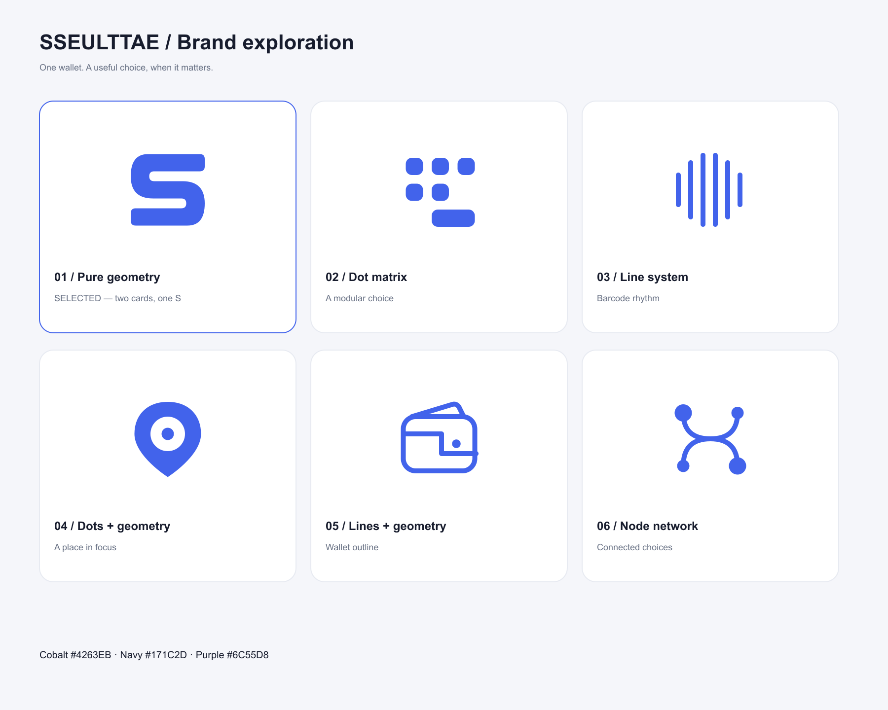

# 쓸때 브랜드 설계와 자산 인계

2026-09-30 · 제품 표시명 **쓸때** · 영문 **SSEULTTAE** · 총괄 선정 반영

## 서비스와 이름

지금 선택한 매장에서 내가 가진 카드·멤버십의 조건을 확인하고, 유리한 수단을 선택한 뒤 필요한 코드를 제시하는 서비스다. 이 사용 순간을 두 음절의 **쓸때**로 표현한다. 브랜드를 표기할 때는 붙여 쓰며, 일반 문장의 ‘쓸 때’에는 띄어쓰기를 유지한다.

- 주 문구: **쓸 때, 내 혜택을 한눈에.**
- 설명 문구: **매장에서 내 카드·멤버십의 유리한 조건을 확인하세요.**
- 앱 내 표기는 쓸때를 우선하고 영문 이름은 브랜드 소개·시스템 메타데이터에서 SSEULTTAE로 통일한다.
- 확정 혜택을 보장하거나 미확인 조건을 최대 할인으로 단정하는 문구는 사용하지 않는다. UNKNOWN·개인 입력·가상 자료·공개 자료의 기존 구별을 유지한다.
- 저장소 이름·기술 패키지·bundle/application ID의 `hyetaekpass`는 유지한다. 제품 표시명 변경과 식별자 변경은 별개다.

사용자가 이름·로고 결정을 위임했고 총괄이 쓸때와 S 심벌을 선정했다. 별도의 사용자 승인 대기 단계는 만들지 않았다.

## 이름 충돌 신호 확인

일반 웹 검색과 `apps.apple.com`, `play.google.com`을 대상으로 한 검색엔진 조회를 시행했다. 검색 결과에서 동일 명칭의 혜택 앱을 확인하지 못한 것은 제한된 충돌 신호 점검이다. 내부 스토어 전체 목록이나 등록 상표 전체를 조사한 결과로 해석하지 않는다.

| 후보 | 실제 확인한 신호 | 결정 |
|---|---|---|
| 딱픽 / DDAKPICK | 동일 이름 앱이 [App Store](https://apps.apple.com/kr/app/%EB%94%B1%ED%94%BD-%EB%82%B1%EB%A7%90%EA%B2%8C%EC%9E%84-%ED%95%98%EB%A9%B4%EC%84%9C-%EC%87%BC%ED%95%91%ED%95%98%EA%B8%B0/id6802186272)와 [Google Play](https://play.google.com/store/apps/details?id=com.dwavetech.ddakpick)에 노출됨 | 제외 |
| 쓸픽 / SSEULPICK | [쓸픽 상품명](https://www.coupang.com/vp/products/9400212287)의 사용 신호 확인 | 제외 |
| 쓸킷 / SSEULKIT | [숲과나눔의 쓸킷 프로젝트 기록](https://koreashe.org/act/?mod=document&uid=3804)에서 기존 명칭 사용 확인 | 제외 |
| 쓸때 / SSEULTTAE | 검색어 `"쓸때"`, `"쓸때" "앱" "서비스"`, `"SSEULTTAE"` 및 공식 앱 사이트 한정 조회. 다른 앱의 후기·일반 문장·로마자 전사 결과가 주로 노출됐으며 동일 제목의 혜택 앱은 확인하지 못함 | 이번 제품 표시명 선정 |

[KIPRIS 공식 서비스](https://www.kipris.or.kr/)의 접근을 확인했으나 개별 상표 사건 조회·유사군 분석·권리 취득은 수행하지 않았다. **등록 가능성·상표 확보·독점 사용권을 표시하지 않는다.** 공개 출시 전 이름·도형·영문 표기의 권리 검토는 별도 외부 작업으로 남는다.

## 심벌과 색

선정안 **01 · 쓸 순간**은 두 카드의 둥근 면을 반대 방향으로 연결해 하나의 S 실루엣을 만든다. 각각의 수단이 결제 순간의 선택으로 이어지는 구조를 담았다. 두 개의 단순 path로 구성해 작은 크기에서도 읽히게 했다. 화살표·할인율·실제 바코드·지도 핀을 선정안에 넣지 않았다.

| 역할 | 색 | 사용 |
|---|---|---|
| Cobalt | `#4263EB` | 주 심벌, 앱 아이콘 배경, 주요 동작 |
| Navy | `#171C2D` | 밝은 화면의 워드마크·본문 |
| Dark navy | `#1B2440` | 어두운 카드·브랜드 배경 |
| Purple | `#6C55D8` | 보조 영역·선택적 브랜드 표현 |
| White | `#FFFFFF` | 어두운 배경 위 심벌·알림 실루엣 |

심벌 SVG는 `viewBox="0 0 100 100"`와 `currentColor`를 사용한다. 앱 아이콘 SVG는 배포 색을 고정한 파생 자산이다. 워드마크의 쓸때 글자는 원본 기하 경로로 직접 구성했으며 폰트 파일이나 외부 이미지를 포함하지 않는다. 앱 헤더에서는 심벌 이미지와 native Text 표시명을 조합해도 된다.

## 서로 다른 검토안 6종

`logo-generator`의 `design_patterns.md`에 제시된 여섯 패턴 계열로 구성했다. 기존 혜택패스 검토안과 별개이며 같은 심벌의 파라미터만 바꾼 변형이 아니다.

| 안 | 패턴 | 개념과 검토 |
|---|---|---|
| 01 · 쓸 순간 | 순수 기하 | 두 카드의 면을 잇는 S. 작은 앱 아이콘의 단일 실루엣과 현재 UI의 절제된 표정에 적합해 선정 |
| 02 · 한 번의 픽 | 도트 매트릭스 | 분리된 카드·멤버십 모듈을 넓은 선택 칸으로 모음. 조건 비교의 모듈성 강조 |
| 03 · 코드의 리듬 | 선 시스템 | 여섯 선의 길이 차이로 코드 제시의 리듬을 표현. 스캔 가능한 코드가 아님 |
| 04 · 지금의 자리 | 점 + 기하 | 장소 윤곽 안의 한 점. 지도 기능으로 오해할 여지가 있어 제외 |
| 05 · 열린 지갑 | 선 + 기하 | 지갑과 카드 입구를 윤곽으로 표현. 작은 크기에서 세부 요소가 많아 제외 |
| 06 · 맞는 조합 | 노드 네트워크 | 여러 선택지가 교차점에서 연결됨. 아이콘 밀도가 높아 제외 |

[로컬 interactive 검토판](../assets/brand/sseulttae/showcase.html)에서 cobalt·navy·어두운 배경 위 흰색·purple을 전환할 수 있다. 스킬의 showcase 구성을 참고해 일반 HTML/CSS로 만들었으며 CDN·외부 폰트·이미지 생성 API·새 제품 의존성이 필요하지 않다.

## 적용 경로

모든 새 파일은 `assets/brand/sseulttae/`에 있다. 기존 `assets/brand/`의 혜택패스 자산을 덮어쓰거나 삭제하지 않았다.

| 경로 | 용도·확인 |
|---|---|
| `symbol.svg` | 선정 심벌 원본, 100 viewBox·currentColor |
| `logo.svg` | 원본 기하 글자와 심벌의 워드마크 |
| `symbol-cobalt-1024.png` | 밝은 화면의 주 심벌, 투명 배경 |
| `symbol-white-1024.png` | 어두운 화면의 심벌, 투명 배경 |
| `symbol-navy-1024.png` | 밝은 화면의 중성 심벌, 투명 배경 |
| `logo-navy-1024.png` | navy 워드마크, 투명 배경·1024px 폭 |
| `app-icon.svg`, `app-icon-1024.png` | store icon 원본과 1024×1024 PNG. RGB·alpha channel 없음·cobalt 배경. 사전 둥근 모서리 없음 |
| `adaptive-foreground.svg`, `adaptive-foreground-1024.png` | Android adaptive 전경 원본과 1024×1024 RGBA. 흰 S를 75%로 축소, 중앙 66/108 안전 원 내부 |
| `favicon-48.png`, `favicon-64.png` | opaque RGB favicon |
| `notification-96.png` | Android 알림용 흰 실루엣·투명 배경. 노출 여부·동의·안전 조건은 기존 로직을 유지 |
| `variants/01-moment.svg` … `06-match.svg` | 서로 다른 검토안 6종, 모두 100 viewBox·currentColor |
| `showcase.html`, `review-board.svg`, `review-board-1800.png` | interactive 비교판·vector/PNG 검토판 |
| `size-check.svg`, `size-check.png` | 실제 16·24·32·48·64·128px 크기의 선택 심벌 비교 |
| `validation.json` | XML·PNG·alpha·안전 원·SHA 검증 기록 |

## 실제 검증과 인계 범위

- 여섯 SVG의 XML 파싱, `viewBox`, title, currentColor, 외부 image/script 부재를 검사했다.
- 기존 bundled `sharp`로 PNG를 export했다. 외부 이미지 생성 API나 키를 사용하지 않았다.
- 앱 아이콘은 1024×1024 RGB이며 alpha channel이 없다. favicon 48·64도 RGB다.
- Adaptive 전경의 alpha bounding box는 `(281, 289, 743, 735)`다. 모든 보이는 픽셀의 중심에서의 최대 반경은 약 309.85px이며 66/108 안전 원 반경 312.89px 안에 들어간다.
- 알림 PNG는 96×96 RGBA이고 보이는 픽셀의 RGB는 모두 흰색이다. 투명 픽셀과 alpha 경계를 검사했다.
- 렌더된 6종 비교판·선정 앱 아이콘·워드마크·크기 비교판을 실제 이미지로 확인했다. 이는 에이전트의 설계·렌더 검사이며 독립 사람의 상표 검토나 실제 단말 launcher 시험을 뜻하지 않는다.

총괄이 앱 이름·theme·app config·메타데이터·UI 적용을 담당한다. 이번 담당자는 앱 코드·Git·기존 native 증거를 수정하지 않았다. 브랜딩 적용 뒤 새 native 산출물의 실제 아이콘·표시명 확인과 빌드는 후속 검증으로 진행한다.
