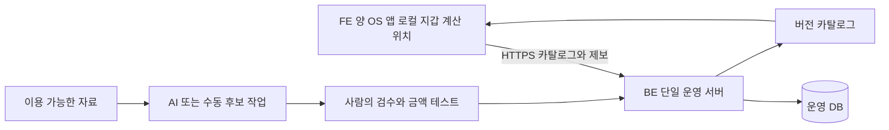

# 혜택패스 통합 사업기획서

버전 v3.1 · 기준일 2026년 9월 30일 · 상태 최종 기획

**1~2인이 생활권 한 곳과 소량의 검수된 혜택으로 앱을 검증하는 것은 가능하다. 전국 할인 자동 통합, 정확한 매장 입장 감지, 두 스토어의 고정일 공개를 함께 약속하는 범위는 현재 조건으로 추진하지 않는다.** Android와 iOS는 공통 앱으로 개발하며, 현재 보유한 iPhone으로 실기기 검증을 먼저 한다. 개발자별 주당 시간은 아직 정해지지 않았다.

이 문서는 제품 범위와 개발·검증·운영 조건을 정의한다. 사업·기술 판단과 착수·중단 기준은 [실현 가능성과 착수 기준](docs/00_실현가능성과_착수기준.md)을 따른다. 최종 기획의 확정은 앱 구현·실기기 시험·AWS 배포·사용 허가·신고·스토어 승인 완료와 구별한다.

## 1 확정 조건과 가정

| 구분 | 내용 |
|---|---|
| 사용자 확정 | 개발자 1~2명, FE·BE·AI 책임 구분, Docker 개발 후 AWS 운영, Android·iOS 모두 사용 가능 |
| 최신 기기 조건 | 테스트 실기기는 iPhone. Android 실기기 확보와 검증 필요 |
| 미정 | 주당 가용시간·기술 경험·예산·계약 주체·기기 모델과 OS·독립 검수자 |
| 초기 범위 가정 | 한국 생활권 1곳, 브랜드 2~3개, 연구 후보 10~20규칙, 사용자 10~15명, 무료 검증판 |
| 출시 순서 | 양 OS 빌드를 처음부터 유지. 실제 검증과 각 스토어 승인 상태로 순서 결정 |

후보 규칙 수는 공개 가능한 규칙 수가 아니다. 권리·의미·검수 조건을 충족하지 못하면 사전 탑재 계산 규칙은 0개일 수 있다. FE·BE·AI는 각각 한 사람이나 상시 서버 한 대를 뜻하지 않는다.

## 2 해결할 문제와 제품 약속

보유한 카드·멤버십의 혜택을 결제 전에 쉽게 확인하게 한다. 사용자가 모르는 조건을 명확히 보여주고 공식 사용 절차로 연결한다. 위치는 발견을 돕는 신호이며 방문 또는 할인 적용의 확정 근거가 아니다.

고객 검증에서는 최근 실제 결제 3건을 재구성한다. 혜택을 몰랐는지, 조건이 복잡했는지, 결제 전에 기억하지 못했는지 구분한다. 사용자가 입력을 포기하거나 지원 데이터가 생활과 겹치지 않으면 위치 알림을 더 붙이는 것으로 해결됐다고 보지 않는다.

| 제공할 약속 | 사용하지 않을 약속 |
|---|---|
| 보유 수단과 공식 조건에 맞는 혜택 확인 | 전국 모든 할인 자동 수집 |
| 입력하고 확인한 조건 기준 예상 금액 | 실제 적용·최대 절감·중복 할인 보장 |
| 앱을 열었을 때 주변 지원 점포 찾기 | GPS로 점포 입장·층·구매 의도 확정 |
| 검증된 OS·장소의 선택형 주변 안내 | 어느 기기든 2분 뒤 반드시 알림 |

입력형 계산기는 데이터 허가 전 시제품 대안이다. 그것만으로 자동 혜택 발견 서비스의 사업 가설이 입증됐다고 간주하지 않는다.

## 3 초기 범위와 확장 순서

| 범위 | 포함할 기능 | 조건 |
|---|---|---|
| 핵심 앱 | 지원 목록, 로컬 보유 수단, 수동 브랜드·점포 선택, 출처·조건·예상, 전체 삭제 | 위치·알림 권한 없이 사용 |
| 데이터 운영 | 수동 후보·실제 검수·버전 게시·차단·롤백·제보 처리 | 소량 이용 가능한 자료와 담당자 |
| 전경 위치 | 생활권 점포 목록, 단말 거리 계산, 직접 지역 선택 | 관련 절차·점포 이용권·기기 검증 |
| 배경 파일럿 | 사용자 선택 주변 알림, 모호한 장소 제한, 지역 묶음 안내 별도 시험 | OS별 기술·동의·심사·현장 품질 |
| 운영 전환 | Docker 서버 검증, AWS HTTPS·DB·파일·복구, 두 스토어 단계 출시 | 각 완료 조건의 실제 증거 |

계정·클라우드 지갑 동기화·금융 실적 자동 연동·카드 발급·영수증 OCR·포인트 최적화·개인 쿠폰 자동 수집·결제·B2B API·전국 카탈로그는 초기 범위에서 제외한다. 실제 반복 수요와 유지 자원이 확인된 항목만 후속 기획한다.

## 4 사용 흐름과 할인 표시

사용자는 지원되는 브랜드·상품을 먼저 확인하고 보유 수단 하나부터 등록한다. 상품·멤버십 등급·전월 실적·잔여 한도는 사용자가 입력하며 모름을 선택할 수 있다. 카드 번호·CVC·금융 로그인 정보를 받지 않는다.

혜택 확인에서는 점포와 결제 채널을 선택하고 필요할 때 금액을 입력한다. 자료 상태, 공식 URL, 확인일, 적용 기간, 제외 조건, 실제 사용 절차를 표시한다. 바코드를 결제 전에 보여야 하면 그 순서를 먼저 안내한다. 공식 앱을 대신하여 쿠폰을 발급·사용하지 않는다.

| 결과 | 표시 원칙 |
|---|---|
| 확인한 조건 기준 예상 | 즉시 할인·현재 결제액·청구 할인 분리. 실제 적용 보장 아님 |
| 조건 확인 필요 | 실적·잔여 횟수·점포·품목·중복 등 미확인 항목과 확인 경로 |
| 안내 전용 | 지원하지 않는 산식·조건의 이유와 공식 이용 경로 |
| 사용자 직접 작성 | 작성자와 입력일·미검수 상태. 공식 검수와 구별 |
| 만료·차단 | 사전 탑재 계산·자동 알림 중지, 갱신 요청 |

초기 계산은 한 결제 카드와 최대 한 멤버십, 정률·정액, 명시된 기준 금액·상한·원 단위 처리로 제한한다. 중복 관계·순서·기준 금액이 모두 확인된 조합만 계산한다. TRUE·FALSE·UNKNOWN을 구분하고 미확인 자격은 기본 합계에서 제외한다. 계산 자체의 의미가 모두 확인된 경우에만 별도의 조건부 시나리오를 보여준다.

예를 들어 가상의 12,000원 구매에서 멤버십 10%·상한 1,000원이 적용되면 현재 결제액은 11,000원이다. 그 뒤 카드 5% 청구 할인 550원은 명시된 중복 허용·자격·계산 기준이 있을 때만 별도로 안내한다. 자격이나 중복이 모르면 1,550원을 기본 합계로 제시하지 않는다. 이 예시는 실제 상품 데이터가 아니다. 상세 지원 계약과 사례는 [데이터 문서](docs/02_할인데이터_확보와_운영.md)를 따른다.

## 5 할인 정보를 확보하고 유지하는 방법

| 데이터 | 초기 확보 방식 | 확인할 핵심 |
|---|---|---|
| 카드 조건 | 공식 상품설명서·약관·허가된 제공 자료 | 실적·횟수·잔여 한도·청구 구분·가맹점·PG·상품 버전 |
| 멤버십 | 공식 브랜드 상세·월간 공지·허가 피드 | 등급·바코드·예약·쿠폰·제외 점포·중복·기간 |
| 단기 행사 | 공식 행사 상세 | 선착순·재고·쿠폰 보유 미확인. 초기 자동 계산에서 제외 |
| 점포 후보 | 이용조건을 확인한 공공 점포 자료 또는 파트너 자료 | 위치·폐점·브랜드. 할인 수용 여부를 증명하지 않음 |
| 작은 제휴 | 생활권 파트너와 직접 협의 | 문서화된 혜택·대상·중복·변경·단말 배포 권리 |
| 사용자 입력 | 단말에서 직접 작성 | 출처·입력일·미검수 표시. 공식 카탈로그로 자동 전환 안 함 |

카드와 멤버십을 모두 포함하는 범용 재배포 피드는 확보되지 않았다. 공식 페이지를 읽을 수 있어도 저장·산식 변환·앱 표시·Android와 iOS 단말 JSON 배포·오프라인 보존·외부 AI 처리·상표·철회 권한은 별도로 확인한다. 확인 실패를 무변경으로 기록하지 않는다.

규칙은 출처와 이용 근거 → 후보 → 형식 검사 → 실제 원문 검수 → 경계·조건·조합 테스트 → 버전 게시 순서로 처리한다. AI는 후보 작성·변경 비교에만 사용하며 사람의 승인 없이 게시하지 못한다. 단순 CSV는 표준 파서로 충분하다.

2인은 작성자 외 사람이 검수한다. 1인은 실제 외부 검수자가 없으면 자기검수·AI 검사를 독립 검수라고 표시하지 않는다. 팀의 품질 정책으로 고위험 사전 탑재 계산은 실제 검수자 확보 전 공개하지 않는다. 허용된 링크 안내와 사용자 입력 시제품으로 가치부터 확인한다.

자료 신선도는 안정 소스 월 확인·45일, 변동 소스 주 확인·14일을 시작안으로 둔다. 혜택·이용권 종료가 빠르면 우선한다. 운영 시간과 변경률을 측정하고 지원 범위를 늘린다. 세부 자료 기록·권리 요청·갱신·시간 예산은 [할인 데이터 확보와 운영](docs/02_할인데이터_확보와_운영.md)에 있다.

## 6 위치 알림과 정보 누락

**횡단보도 2분 대기와 매장 2분 체류는 GPS 반경·속도만으로 구별할 수 없다.** 정류장·정체·인접 가게·여러 층도 같은 문제가 있다. 시간을 늘리면 오탐이 남으면서 짧은 실제 방문을 놓칠 수 있다. 지오펜스 사건도 실제 도착보다 늦을 수 있으므로 결제 전 도달을 평가한다.

알림을 제한하면 발견 기회가 줄어드는 것은 사실이다. 모호한 장소의 매장·혜택 데이터를 삭제하지 않고 제공 경로를 나눈다.

| 경로 | 모호한 장소 처리 | 평가 |
|---|---|---|
| 수동·전경 검색 | 지원 점포·혜택을 계속 표시하고 사용자가 선택 | 앱을 안 열면 놓칠 수 있다는 한계 유지 |
| 기본 자동 주변 안내 | 관측·현장 품질이 확인된 장소부터. 어려운 곳은 발화 제한 | 제외 장소의 실제 방문도 전체 누락에 포함 |
| 사용자가 선택한 지역 안내 | 여러 점포를 묶어 “주변 혜택 확인”으로 별도 시험 | 횡단보도에서도 울릴 수 있음. 실제 지역 진입 과업·유용성·피로 별도 평가 |
| 즐겨찾기·시간 알림 | 검색 접근성 또는 사용자가 정한 시간 알림 | 즐겨찾기 지오펜스도 배경 위치 정책을 따라야 함 |

기본 알림은 설정·동의·OS 권한, 플랫폼·장소 flag, 최신 유효 관측, 관련 혜택·자료 유효성, 쿨다운·하루 한도를 모두 평가한다. 체류 시간만으로 발화하지 않는다. 초기 값은 후보 반경 150m, 5~10개 점포 또는 묶음, 기본 비교 120초, 실제 관측 3회 이상·공백 60초 이하·마지막 위치 30초 이내, 하루 2건·묶음과 브랜드 24시간 쿨다운이다. 이 값은 실험 제안이며 검증 결과가 아니다.

지역 안내는 사용자 선택·별도 발화 정책·평가를 갖춘 완화 실험이다. 120초 체류나 매장 방문을 약속하지 않고, 최신 위치·권리·동의·심사·빈도 제한은 유지한다. 문구를 일반적으로 바꿨다는 이유로 무관한 알림을 성공 처리하지 않는다.

실행 기회가 없어 최신 관측을 얻지 못하면 보류·만료한다. iOS의 JS 타이머·BGTask·silent push와 미리 예약한 120초 알림을 체류 보장으로 쓰지 않는다. 두 OS의 사건·정밀 권한·절전·종료 동작이 다르므로 공통 화면과 실제 플랫폼 검증을 구분한다.

초기 기본 경로는 단말 로컬 알림이다. 서버 좌표 스트림·push token은 없다. 잠금화면에 카드명·실적·좌표·보장 금액을 넣지 않는다. 21:00~08:00에는 초기 광고 알림을 제공하지 않는다. 위치·알림 권한을 거절해도 기본 검색은 유지한다.

표본·오탐·누락·coverage·지연·결제 전 도달·배터리·권한 실패와 폴백은 [위치 정책과 검증](docs/01_위치알림_정책과_검증.md)을 따른다. 자동 활성 장소만 분모로 골라 성능을 높이지 않는다. Android 실기기 확보 전 Android 배경 품질을 통과 처리하지 않는다.

## 7 FE BE AI와 실행 구조

React Native·TypeScript 화면과 하나의 계산 엔진을 공유한다. 위치·권한·알림은 OS 기능과 연결한다. Spring BE는 카탈로그·검수·릴리스·차단·제보·감사를 하나의 앱에서 처리한다. Python AI는 필요할 때만 실행하는 비개인 자료 보조 작업이다. BE에 별도의 Java 계산 엔진을 중복 구현하지 않는다.

계획 구조는 `FE/mobile`, `FE/admin`, `BE`, `AI`, `packages/benefit-core`, `contracts`, `infra/local`, `infra/aws`, `docs`다. 개발 필요 전에 빈 미래 코드나 상시 AI 서비스·Redis·벡터 DB·Kubernetes를 추가하지 않는다.

Docker는 BE·DB·선택형 AI 작업을 재현한다. iOS 빌드·서명·기기 시험은 Mac·Xcode, Android는 개발 도구와 실제 기기를 사용한다. 휴대폰의 localhost는 Mac이 아니므로 개발 연결·포트·debug HTTP 예외와 운영 HTTPS를 구분한다.

AWS 기본안은 서울 ALB·ACM·WAF, Fargate Spring 한 task, private RDS PostgreSQL Single-AZ, private S3와 CloudFront다. task ingress는 ALB SG만, DB는 API SG만 허용한다. 비밀과 배포 권한은 role·Secrets Manager·CI OIDC로 관리한다. 단일 task와 DB는 고가용성 약속이 아니다.

파일은 업로드·검증 후 활성 포인터를 바꾼다. 단말은 Schema·해시·호환·기간 검증 뒤 원자 교체한다. 새 차단·기능 OFF는 파일 다운로드 실패와 무관하게 우선 적용하고 롤백에서도 유지한다. 실패한 안전 조회는 확인 시각을 연장하지 않는다. 마지막 정상 안전 확인 최대 24시간, 원문 기한·혜택·권리 종료 중 가장 이른 기한이 적용된다. 무통신 단말의 즉시 철회는 보장하지 않는다.

코드·카탈로그·DB·모바일 바이너리의 복구를 구분한다. 차단·삭제 요청은 독립 journal에 먼저 영속 기록하고 DB에 멱등 적용한다. DB 복구 후 journal 재적용·검증 전에는 공개 재개와 정상 안전 응답을 보류한다. 전체 삭제 시 OS 지오펜스·위치 작업·예약 알림·DB·키를 정리한다. 전체 구조도·모델·API·Docker·AWS·복구 계약은 [아키텍처 문서](docs/03_아키텍처_Docker_AWS.md)를 따른다.

## 8 법률 개인정보와 권리

단말 위치 처리와 계정 없음은 모든 의무의 면제 근거가 아니다. 실제 위치 서비스 분류·사업 신고·소규모 자격·약관·동의·확인자료 기록을 검토한다. 개발자 한 명이라는 사실과 법적 소규모 자격을 동일시하지 않는다.

OS 권한, 위치 서비스 동의, 광고성 정보 수신 동의를 구분하고 거절 시 수동 기능을 유지한다. 할인·쿠폰 알림의 광고성은 실제 요청·목적·문구로 판단하며 로컬 알림이라는 이유만으로 면제하지 않는다. 국외 처리와 위탁은 실제 SDK·cloud·AI 흐름으로 확인한다.

지갑·현재 위치는 기본적으로 단말에서 처리한다. 서버 접속 로그·제보·운영자 인증·오류 SDK에는 개인정보가 있을 수 있다. 실제 항목·목적·보존·삭제·backup·사고 대응을 문서화하고 release build의 통신과 스토어 공개를 대조한다. 법정 통지·신고 시계는 평일 지원창과 별개다.

공식 근거와 외부 확인 질문은 [법률 개인정보와 출처](docs/05_법률개인정보_및_출처.md)에 있다. 실제 권리·신고·동의·기기·심사 증거가 없으면 상태를 확인 필요로 유지한다.

## 9 인원 일정 비용

핵심과 전경 기능의 시작 추정은 팀 합계 800~1,100시간, 배경 알림을 공개 후보로 검증하는 추가 공수는 200~400시간이다. 팀 경험·데이터·기기·외부 대기에 따라 달라진다. 주간 작업량은 인원 × 1인 주당 시간 × 0.70으로 계산한다.

| 가용시간 시나리오 | 핵심과 전경 산술 일정 | 배경 포함 산술 일정 |
|---|---:|---:|
| 2명 각 주 40시간 | 약 15~20주 | 약 18~27주 |
| 1명 주 40시간 또는 2명 각 주 20시간 | 약 29~40주 | 약 36~54주 |
| 1명 주 20시간 | 약 58~79주 | 약 72~108주 |

이 기간은 외부 회신·기기 확보·테스트 모집·스토어 승인을 포함한 공개 약속이 아니다. 첫 2주 실제 작업 후 다시 계산하고, 두 OS의 실제 검증·승인 상태로 공개 날짜를 정한다.

AWS 공식 단가의 소규모 관리형 예시는 월 약 101.55 USD이며 초기 관리예산은 월 120~200 USD와 별도 비용을 제안한다. 서울·730시간·ARM64·가정한 사용량이며 세금·환율·크레딧·인력·데이터·기기·법률·CI·스토어 등은 별도다. 생성 전 실제 견적과 계정 조건을 확인한다.

현금과 개발자 기회비용을 분리하고 실제 인력 시간·외부 견적·계정 청구로 예산을 정한다. 상세 공수·산식·공식 SKU·대안·스토어 요건은 [개발계획 비용 출시 운영](docs/04_개발계획_비용_출시운영.md)을 따른다.

## 10 검증과 공개 조건

| 영역 | 통과 조건 |
|---|---|
| 가치 | 실제 지원 수단·점포 과업에서 유용한 혜택 또는 확인 항목 발견. 입력 포기·미지원도 기록 |
| 계산 | 모든 필수 경계·조건·중복·만료·미지원 사례 통과. 알려진 금액 오류 0건 |
| 데이터 | 실제 이용권·원문·검수·갱신·단말 배포·철회 조건 충족 |
| 기기 | iPhone 먼저, Android 실기기까지 확인. 두 OS release 모드·삭제·권한·종료·backup 시험 |
| 자동 알림 | 각 OS·장소의 실제 품질·동의·정책 검증. 누락·피로 포함, 실패 flag 비활성화 |
| 운영 | 게시·차단·제보 inbox·복구·비용·담당·대리·사고 절차가 실제 수행 가능 |
| 법률과 스토어 | 해당 절차와 실제 두 스토어 제출·승인. AWS 운영만으로 앱 출시 완료 표시 금지 |

위치 탐색은 iPhone 양성 20회·음성 40회부터, 공개 후보는 플랫폼별 새로운 양성 60회·음성 100회 등을 계획한다. 이는 제안 표본이며 기기·사람·경로 편향과 신뢰구간을 보고한다. 오탐 5%·적절성 90%·coverage 70%는 시작 수용 가설이며 실측 통과값이 아니다.

## 11 운영과 수익화

일반 제보는 평일 하루 한 번 확인·2영업일 내 분류를 시작안으로 두고 실제 담당자가 확정한다. 위험 규칙·권리 철회·보안 사고는 별도 즉시 대응 경로를 둔다. 검수 부재 시 확인일만 갱신하지 않는다.

소량 카탈로그도 초기 약 39시간, 주간 약 5.5시간의 데이터 운영이 들 수 있다는 예시를 사용한다. 변경률과 지원 시간을 실제 측정한다. 데이터·지원이 팀 주당 시간의 20%를 2주 연속 넘으면 신규 소스 추가를 동결한다. 주 20시간의 1인 팀은 이 상한이 주 4시간이므로 해당 운영 예시보다 작은 카탈로그 또는 별도 운영 협력이 필요하다.

무료 파일럿에서 사용가치·공급·운영을 먼저 확인한다. 광고·발급 중개·유료 기능·B2B는 실제 계약·정책·수익성을 갖춘 후 별도 결정한다. 후원 상품을 계산 순위에 섞지 않으며 청구내역 없이 실제 절감액을 확정 KPI로 삼지 않는다.

## 12 착수 순서와 중단선

1. 가용시간·경험·기기·주체를 기록하고 양 OS 작은 앱과 Docker 연결을 확인한다.
2. 연구 자료 10건과 실제 사용자 과업으로 공급·검수·입력 마찰을 측정한다.
3. 법률·권리 질문을 해결하면서 iPhone의 위치 실행 기회·횡단보도·누락을 초반에 검증한다.
4. 핵심 앱·소량 카탈로그·전경 기능부터 완성하고 Android 실기기 시험을 진행한다.
5. 공개 전 AWS 복구·제보·차단·비용을 검증하고 각 스토어 조건에 맞게 제출한다.
6. 배경 자동 알림은 OS·장소별 증거가 있는 범위만 켠다. 선택형 지역 안내도 별도 품질 평가를 통과해야 한다.

데이터 권리를 확보하지 못하거나 입력형 제품에 가치가 없으면 자동 발견 서비스 확대를 멈춘다. 위치가 늦거나 누락·무관한 발화가 많으면 약속과 모드를 바꾼다. 전경·수동 기능만으로도 가치가 없으면 출시 일정 대신 제품 가설을 다시 검토한다. 운영 시간이 감당되지 않으면 카탈로그와 기능을 줄인다.

## 문서별 기준

| 문서 | 담당하는 내용 |
|---|---|
| [실현 가능성과 착수 기준](docs/00_실현가능성과_착수기준.md) | 현재 범위의 사업·기술 판단, 고객 가설, 위험·중단 조건 |
| [위치 정책과 실기기 검증](docs/01_위치알림_정책과_검증.md) | OS 제약, 기본·지역 안내, 누락·오탐, 시험·활성 조건 |
| [할인 데이터 확보와 운영](docs/02_할인데이터_확보와_운영.md) | 실제 연구 사례, 권리·산식·미확인·검수·갱신·AI |
| [아키텍처 Docker AWS](docs/03_아키텍처_Docker_AWS.md) | 구조도, 저장소·모델·API·릴리스·단말·인프라·복구 |
| [개발계획 비용 출시 운영](docs/04_개발계획_비용_출시운영.md) | 공수·가용시간·역할·예산·공식 요금·스토어·운영 |
| [법률 개인정보와 출처](docs/05_법률개인정보_및_출처.md) | 공식 요건, 실제 흐름·동의·보존·확인 질문·출처 상태 |

세부 숫자와 계약은 담당 문서를 기준으로 갱신하고 이 기획서의 요약을 함께 맞춘다. 확인되지 않은 자료·가정·승인을 완료로 바꾸지 않는다.
